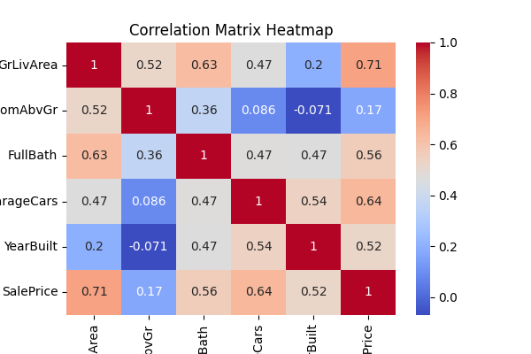
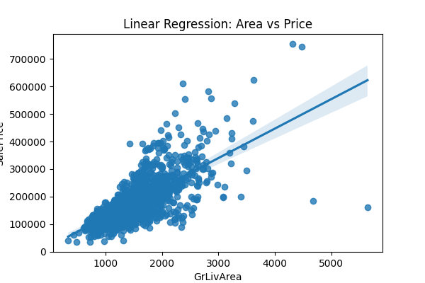

# 🏡 House Price Prediction - PRODIGY_ML_01

## 📌 Task 1 - Machine Learning Internship

This project implements a Linear Regression model to predict house prices based on important features.

---

## 🚀 Features Used

* GrLivArea (Living Area)
* BedroomAbvGr (Number of Bedrooms)
* FullBath (Number of Bathrooms)

---

## 🧠 Project Workflow

* Data loading and preprocessing
* Feature selection
* Model training using Linear Regression
* Model evaluation using MAE and R² Score
* Data visualization using heatmap and regression plot

---

## 📊 Model Performance

* Evaluated using:

  * Mean Absolute Error (MAE)
  * R² Score

* Example Results:

  * R² Score: ~0.75
  * MAE: ~25000

---

## 📈 Visualizations

* Correlation Heatmap
* Scatter Plot with Regression Line

---

## 🛠️ Technologies Used

* Python
* Pandas
* Scikit-learn
* Matplotlib
* Seaborn

---

## 📷 Output

---

## 🎯 Conclusion

This project strengthened my understanding of Machine Learning concepts and gave me hands-on experience in building and evaluating regression models using real-world data.

---

## 👤 Author

Rutuja Jilhawar
